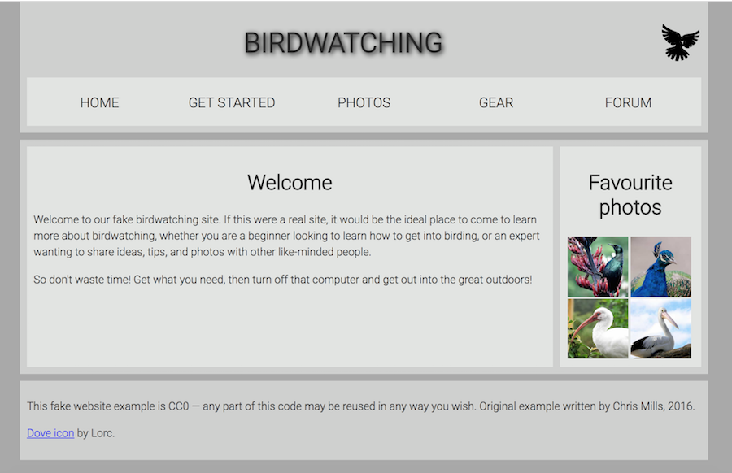

# Structuring the Web
*Welcome to the first assigment!*

To start this assessment you should clone this repository. You'll work on your local computer (remember to commit your work!). When you are ready, you can push to your remote repository.

You'll find
1. the HTML you need to add structural markup to.
1. CSS to style your markup.
1. Images that are used on the page.

Structuring a page of content ready for laying it out using CSS is a very important skill to master, so in this assessment you'll be tested on your ability to think about how a page might end up looking, and choose appropriate structural semantics to build a layout on top of.

## Project brief, the assignment

For this project, your task is to take the content for the homepage of a bird watching website and add structural elements to it so it can have a page layout applied to it. 

It needs to have:

* A header spanning the full width of the site containing the main title for the page, the site logo, and the navigation menu. The title and logo appear side by side once styling is applied, and the navigation appears below those two items.
* A main content area containing two columns — a main block to contain the welcome text, and a sidebar to contain image thumbnails.
* A footer containing copyright information and credits.

You need to add a suitable wrapper for:
* Apply the provided CSS to the page by adding another <link> element just below the existing one provided at the start.

## Result
When you finished, your homepage should look much better!

## Hints and tips

* Use the [W3C HTML validator Chrome extension](https://chrome.google.com/webstore/detail/html-validator/mpbelhhnfhfjnaehkcnnaknldmnocglk) to validate your HTML. You'll get bonus points if it validates as much as possible (the "googleapis" line is used to import custom fonts into the page from the Google Fonts service; [it doesn't validate](https://stackoverflow.com/questions/22466913/google-fonts-url-break-html5-validation-on-w3-org), but don't worry about too much about it — the validator is a useful tool, but 100% validation is an ideal rather than completely necessary.)

* You don't need to know any CSS to do this assessment; you just need to put the provided CSS inside an HTML element.
* The provided CSS is designed so that when the correct structural elements are added to the markup, they will appear green in the rendered page.
* If you are getting stuck and can't envisage what elements to put where, it often helps to draw out a simple block diagram of the page layout, and write on the elements you think should wrap each block.

## References

[Internet is hard - Semantic HTML](https://internetingishard.com/html-and-css/semantic-html/)  
[MDN - Document and website structure](https://developer.mozilla.org/en-US/docs/Learn/HTML/Introduction_to_HTML/Document_and_website_structure)
